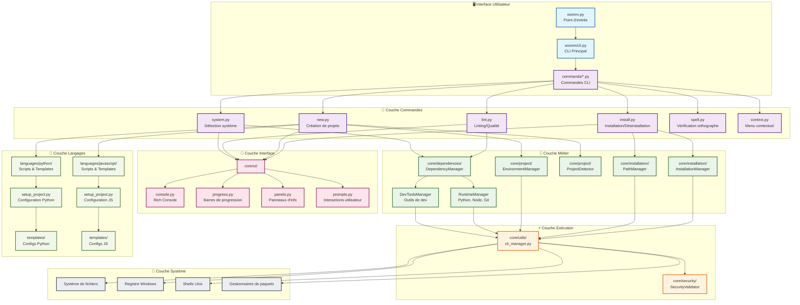
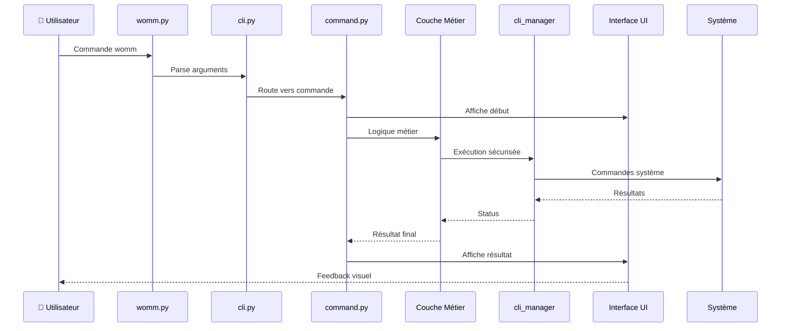

# Architecture Globale - Works On My Machine

## Découpage des Processus selon Logique Métier

```mermaid
graph TB
    subgraph "🖥️ Interface Utilisateur"
        CLI[womm.py<br/>Point d'entrée] --> MAIN[womm/cli.py<br/>CLI Principal]
        MAIN --> COMMANDS[commands/*.py<br/>Commandes CLI]
    end
    
    subgraph "🎯 Couche Commandes"
        COMMANDS --> INSTALL[install.py<br/>Installation/Désinstallation]
        COMMANDS --> NEW[new.py<br/>Création de projets]
        COMMANDS --> LINT[lint.py<br/>Linting/Qualité]
        COMMANDS --> SYSTEM[system.py<br/>Détection système]
        COMMANDS --> SPELL[spell.py<br/>Vérification orthographe]
        COMMANDS --> CONTEXT[context.py<br/>Menu contextuel]
    end
    
    subgraph "🧠 Couche Métier"
        INSTALL --> INSTMGR[core/installation/<br/>InstallationManager]
        INSTALL --> PATHMGR[core/installation/<br/>PathManager]
        
        NEW --> PROJDET[core/project/<br/>ProjectDetector]
        NEW --> ENVMGR[core/project/<br/>EnvironmentManager]
        
        LINT --> DEPS[core/dependencies/<br/>DependencyManager]
        SYSTEM --> DEPS
        
        DEPS --> RUNTIME[RuntimeManager<br/>Python, Node, Git]
        DEPS --> DEVTOOLS[DevToolsManager<br/>Outils de dev]
    end
    
    subgraph "⚡ Couche Exécution"
        INSTMGR --> CLIMGR[core/utils/<br/>cli_manager.py]
        PATHMGR --> CLIMGR
        ENVMGR --> CLIMGR
        RUNTIME --> CLIMGR
        DEVTOOLS --> CLIMGR
        
        CLIMGR --> SEC[core/security/<br/>SecurityValidator]
    end
    
    subgraph "🎨 Couche Interface"
        INSTALL --> UI[core/ui/]
        NEW --> UI
        LINT --> UI
        SYSTEM --> UI
        
        UI --> CONSOLE[console.py<br/>Rich Console]
        UI --> PROGRESS[progress.py<br/>Barres de progression]
        UI --> PANELS[panels.py<br/>Panneaux d'info]
        UI --> PROMPTS[prompts.py<br/>Interactions utilisateur]
    end
    
    subgraph "🔧 Couche Langages"
        NEW --> PYLANG[languages/python/<br/>Scripts & Templates]
        NEW --> JSLANG[languages/javascript/<br/>Scripts & Templates]
        
        PYLANG --> PYSETUP[setup_project.py<br/>Configuration Python]
        JSLANG --> JSSETUP[setup_project.py<br/>Configuration JS]
        
        PYSETUP --> PYTEMPLATES[templates/<br/>Configs Python]
        JSSETUP --> JSTEMPLATES[templates/<br/>Configs JS]
    end
    
    subgraph "💾 Couche Système"
        CLIMGR --> FILESYSTEM[Système de fichiers]
        CLIMGR --> REGISTRY[Registre Windows]
        CLIMGR --> SHELLS[Shells Unix]
        CLIMGR --> PACKAGES[Gestionnaires de paquets]
    end
    
    %% Styles
    classDef cli fill:#e1f5fe,stroke:#01579b,stroke-width:2px
    classDef command fill:#f3e5f5,stroke:#4a148c,stroke-width:2px
    classDef business fill:#e8f5e8,stroke:#1b5e20,stroke-width:2px
    classDef execution fill:#fff3e0,stroke:#e65100,stroke-width:2px
    classDef ui fill:#fce4ec,stroke:#880e4f,stroke-width:2px
    classDef language fill:#f1f8e9,stroke:#33691e,stroke-width:2px
    classDef system fill:#eceff1,stroke:#263238,stroke-width:2px
    
    class CLI,MAIN cli
    class COMMANDS,INSTALL,NEW,LINT,SYSTEM,SPELL,CONTEXT command
    class INSTMGR,PATHMGR,PROJDET,ENVMGR,DEPS,RUNTIME,DEVTOOLS business
    class CLIMGR,SEC execution
    class UI,CONSOLE,PROGRESS,PANELS,PROMPTS ui
    class PYLANG,JSLANG,PYSETUP,JSSETUP,PYTEMPLATES,JSTEMPLATES language
    class FILESYSTEM,REGISTRY,SHELLS,PACKAGES system
```

## Flux de Données Principal

```mermaid
sequenceDiagram
    participant User as 👤 Utilisateur
    participant CLI as womm.py
    participant Main as cli.py
    participant Cmd as command.py
    participant Business as Couche Métier
    participant Exec as cli_manager
    participant UI as Interface UI
    participant System as Système
    
    User->>CLI: Commande womm
    CLI->>Main: Parse arguments
    Main->>Cmd: Route vers commande
    Cmd->>UI: Affiche début
    Cmd->>Business: Logique métier
    Business->>Exec: Exécution sécurisée
    Exec->>System: Commandes système
    System-->>Exec: Résultats
    Exec-->>Business: Status
    Business-->>Cmd: Résultat final
    Cmd->>UI: Affiche résultat
    UI-->>User: Feedback visuel
```
