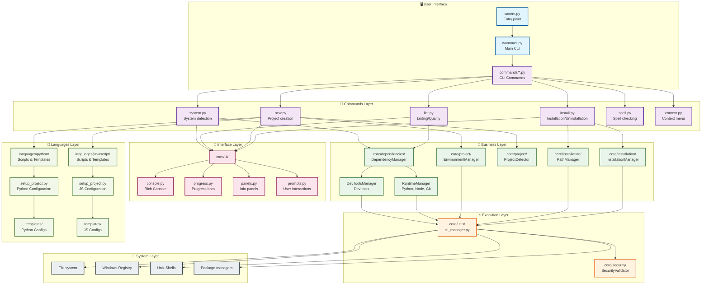
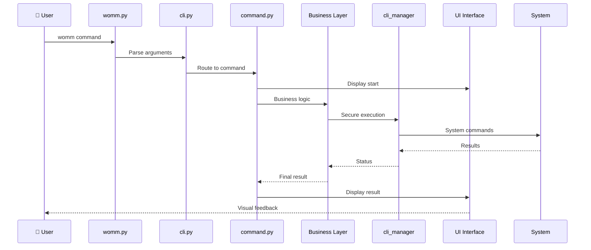

# Global Architecture - Works On My Machine

## Process Breakdown by Business Logic

```mermaid
graph TB
    subgraph "🖥️ User Interface"
        CLI[womm.py<br/>Entry point] --> MAIN[womm/cli.py<br/>Main CLI]
        MAIN --> COMMANDS[commands/*.py<br/>CLI Commands]
    end

    subgraph "🎯 Commands Layer"
        COMMANDS --> INSTALL[install.py<br/>Installation/Uninstallation]
        COMMANDS --> NEW[new.py<br/>Project creation]
        COMMANDS --> LINT[lint.py<br/>Linting/Quality]
        COMMANDS --> SYSTEM[system.py<br/>System detection]
        COMMANDS --> SPELL[spell.py<br/>Spell checking]
        COMMANDS --> CONTEXT[context.py<br/>Context menu]
    end

    subgraph "🧠 Business Layer"
        INSTALL --> INSTMGR[core/installation/<br/>InstallationManager]
        INSTALL --> PATHMGR[core/installation/<br/>PathManager]

        NEW --> PROJDET[core/project/<br/>ProjectDetector]
        NEW --> ENVMGR[core/project/<br/>EnvironmentManager]

        LINT --> DEPS[core/dependencies/<br/>DependencyManager]
        SYSTEM --> DEPS

        DEPS --> RUNTIME[RuntimeManager<br/>Python, Node, Git]
        DEPS --> DEVTOOLS[DevToolsManager<br/>Dev tools]
    end

    subgraph "⚡ Execution Layer"
        INSTMGR --> CLIMGR[core/utils/<br/>cli_manager.py]
        PATHMGR --> CLIMGR
        ENVMGR --> CLIMGR
        RUNTIME --> CLIMGR
        DEVTOOLS --> CLIMGR

        CLIMGR --> SEC[core/security/<br/>SecurityValidator]
    end

    subgraph "🎨 Interface Layer"
        INSTALL --> UI[core/ui/]
        NEW --> UI
        LINT --> UI
        SYSTEM --> UI

        UI --> CONSOLE[console.py<br/>Rich Console]
        UI --> PROGRESS[progress.py<br/>Progress bars]
        UI --> PANELS[panels.py<br/>Info panels]
        UI --> PROMPTS[prompts.py<br/>User interactions]
    end

    subgraph "🔧 Languages Layer"
        NEW --> PYLANG[languages/python/<br/>Scripts & Templates]
        NEW --> JSLANG[languages/javascript/<br/>Scripts & Templates]

        PYLANG --> PYSETUP[setup_project.py<br/>Python Configuration]
        JSLANG --> JSSETUP[setup_project.py<br/>JS Configuration]

        PYSETUP --> PYTEMPLATES[templates/<br/>Python Configs]
        JSSETUP --> JSTEMPLATES[templates/<br/>JS Configs]
    end

    subgraph "💾 System Layer"
        CLIMGR --> FILESYSTEM[File system]
        CLIMGR --> REGISTRY[Windows Registry]
        CLIMGR --> SHELLS[Unix Shells]
        CLIMGR --> PACKAGES[Package managers]
    end

    %% Styles
    classDef cli fill:#e1f5fe,stroke:#01579b,stroke-width:2px
    classDef command fill:#f3e5f5,stroke:#4a148c,stroke-width:2px
    classDef business fill:#e8f5e8,stroke:#1b5e20,stroke-width:2px
    classDef execution fill:#fff3e0,stroke:#e65100,stroke-width:2px
    classDef ui fill:#fce4ec,stroke:#880e4f,stroke-width:2px
    classDef language fill:#f1f8e9,stroke:#33691e,stroke-width:2px
    classDef system fill:#eceff1,stroke:#263238,stroke-width:2px

    class CLI,MAIN cli
    class COMMANDS,INSTALL,NEW,LINT,SYSTEM,SPELL,CONTEXT command
    class INSTMGR,PATHMGR,PROJDET,ENVMGR,DEPS,RUNTIME,DEVTOOLS business
    class CLIMGR,SEC execution
    class UI,CONSOLE,PROGRESS,PANELS,PROMPTS ui
    class PYLANG,JSLANG,PYSETUP,JSSETUP,PYTEMPLATES,JSTEMPLATES language
    class FILESYSTEM,REGISTRY,SHELLS,PACKAGES system
```

## Main Data Flow

```mermaid
sequenceDiagram
    participant User as 👤 User
    participant CLI as womm.py
    participant Main as cli.py
    participant Cmd as command.py
    participant Business as Business Layer
    participant Exec as cli_manager
    participant UI as UI Interface
    participant System as System

    User->>CLI: womm command
    CLI->>Main: Parse arguments
    Main->>Cmd: Route to command
    Cmd->>UI: Display start
    Cmd->>Business: Business logic
    Business->>Exec: Secure execution
    Exec->>System: System commands
    System-->>Exec: Results
    Exec-->>Business: Status
    Business-->>Cmd: Final result
    Cmd->>UI: Display result
    UI-->>User: Visual feedback
```
