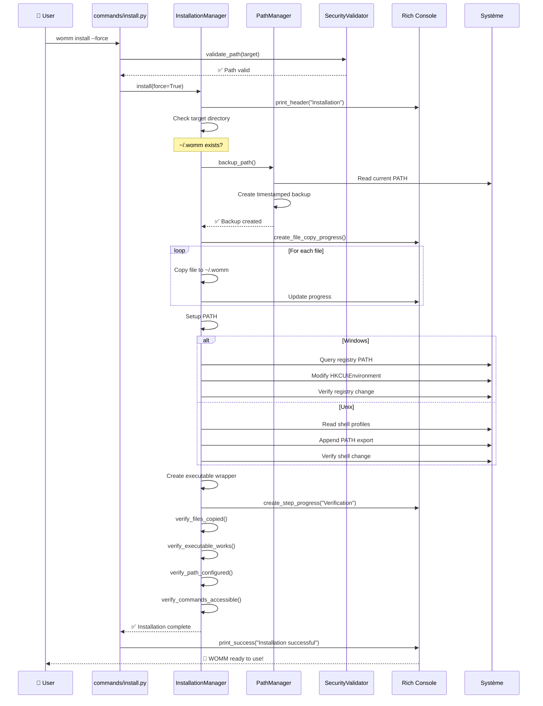

# Flow Install - womm install

## Processus d'Installation Globale

```mermaid
flowchart TD
    START([👤 womm install]) --> PARSE[📋 Parse Arguments<br/>--force, --target]
    PARSE --> VALIDATE[🔒 Security Validation<br/>Validate target path]
    
    VALIDATE -->|✅ Valid| INSTMGR[🏗️ InstallationManager<br/>Initialize with target]
    VALIDATE -->|❌ Invalid| ERROR1[❌ Exit with error]
    
    INSTMGR --> CHECKDIR[📁 Check Target Directory<br/>~/.womm exists?]
    
    CHECKDIR -->|Exists & !force| CONFIRM[❓ Show Warning Panel<br/>Directory exists]
    CHECKDIR -->|Exists & force| BACKUP
    CHECKDIR -->|Not exists| BACKUP
    
    CONFIRM -->|Yes| BACKUP[💾 PATH Backup<br/>PathManager.backup_path()]
    CONFIRM -->|No| CANCEL[🚫 Installation cancelled]
    
    BACKUP -->|✅ Success| COPY[📂 Copy Files<br/>Progress bar + file filtering]
    BACKUP -->|❌ Failed| ERROR2[❌ PATH backup failed]
    
    COPY --> EXCLUDE[🚫 Apply Exclusions<br/>ignore-install.txt patterns]
    EXCLUDE --> PATHSETUP[🛤️ Setup PATH<br/>Platform detection]
    
    PATHSETUP -->|Windows| WINPATH[🪟 Windows PATH<br/>Registry modification]
    PATHSETUP -->|Unix| UNIXPATH[🐧 Unix PATH<br/>Shell profile modification]
    
    WINPATH --> REGBACKUP[💾 Registry Backup]
    REGBACKUP --> REGMOD[✏️ Modify HKCU\Environment]
    REGMOD --> REGVERIFY[✅ Verify Registry Change]
    
    UNIXPATH --> SHELLBACKUP[💾 Shell Profile Backup]
    SHELLBACKUP --> SHELLMOD[✏️ Modify .bashrc/.zshrc]
    SHELLMOD --> SHELLVERIFY[✅ Verify Shell Change]
    
    REGVERIFY --> CREATEEXE
    SHELLVERIFY --> CREATEEXE
    
    CREATEEXE[🔧 Create WOMM Executable<br/>Platform-specific wrapper] --> VERIFY[🔍 Multi-step Verification]
    
    VERIFY --> VERIFYFILES[📁 Verify Files Copied]
    VERIFYFILES --> VERIFYEXE[🔧 Verify Executable Works]
    VERIFYEXE --> VERIFYPATH[🛤️ Verify PATH Configured]
    VERIFYPATH --> VERIFYCMD[⚡ Verify Commands Accessible]
    
    VERIFYCMD -->|✅ All Pass| SUCCESS[🎉 Installation Success<br/>Display completion message]
    VERIFYCMD -->|❌ Any Fail| ROLLBACK[🔄 Rollback Changes<br/>Restore PATH backup]
    
    ROLLBACK --> ERROR3[❌ Installation failed<br/>Changes reverted]
    
    %% Error endings
    ERROR1 --> END1[🛑 End]
    ERROR2 --> END2[🛑 End]
    CANCEL --> END3[🛑 End]
    ERROR3 --> END4[🛑 End]
    SUCCESS --> END5[✨ End]
    
    %% Styles
    classDef startEnd fill:#e1f5fe,stroke:#01579b,stroke-width:3px
    classDef process fill:#e8f5e8,stroke:#1b5e20,stroke-width:2px
    classDef decision fill:#fff3e0,stroke:#e65100,stroke-width:2px
    classDef error fill:#ffebee,stroke:#c62828,stroke-width:2px
    classDef success fill:#e8f5e8,stroke:#2e7d32,stroke-width:3px
    classDef security fill:#f3e5f5,stroke:#4a148c,stroke-width:2px
    
    class START,END1,END2,END3,END4,END5 startEnd
    class PARSE,INSTMGR,BACKUP,COPY,EXCLUDE,PATHSETUP,WINPATH,UNIXPATH,REGBACKUP,REGMOD,SHELLBACKUP,SHELLMOD,CREATEEXE,VERIFY,VERIFYFILES,VERIFYEXE,VERIFYPATH,VERIFYCMD,ROLLBACK process
    class CHECKDIR,CONFIRM decision
    class ERROR1,ERROR2,ERROR3,CANCEL error
    class SUCCESS,REGVERIFY,SHELLVERIFY success
    class VALIDATE security
```

## Séquence d'Installation Détaillée


