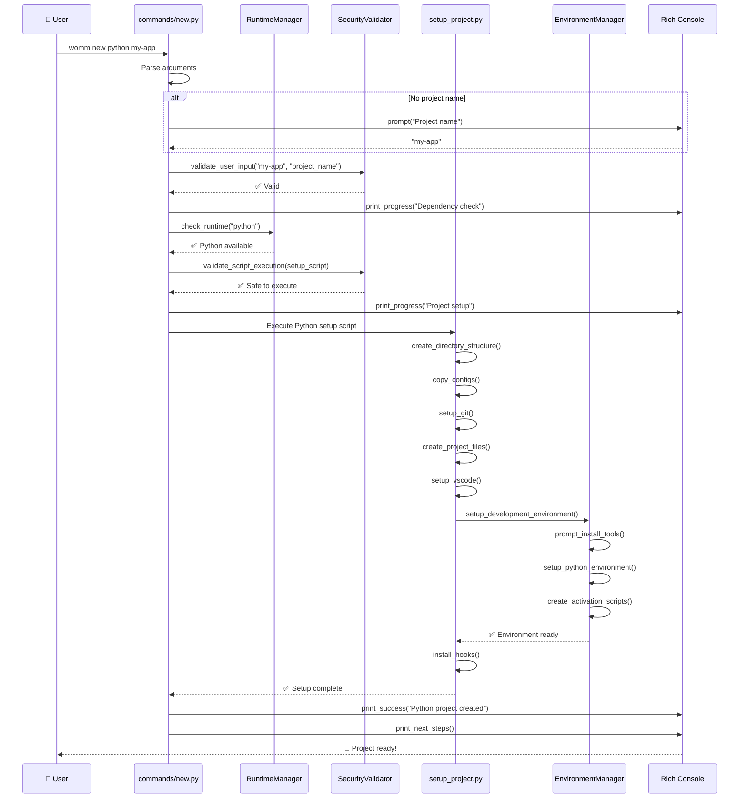

# Flow New - womm new [language] [project]

## Processus de Création de Projets

```mermaid
flowchart TD
    START([👤 womm new python my-project]) --> PARSE[📋 Parse Arguments<br/>language, project_name, options]
    PARSE --> PROMPT{🤔 Project name provided?}
    
    PROMPT -->|No| ASKNAME[❓ Prompt for project name<br/>Interactive input]
    PROMPT -->|Yes| VALIDATE
    ASKNAME --> VALIDATE[🔒 Security Validation<br/>Validate project name]
    
    VALIDATE -->|✅ Valid| DEPCHECK[🔍 Dependency Check<br/>RuntimeManager.check_runtime()]
    VALIDATE -->|❌ Invalid| ERROR1[❌ Invalid project name]
    
    DEPCHECK -->|✅ Available| SCRIPTVAL
    DEPCHECK -->|❌ Missing| INSTALL[📦 Auto-install Runtime<br/>RuntimeManager.install_runtime()]
    
    INSTALL -->|✅ Success| SCRIPTVAL
    INSTALL -->|❌ Failed| ERROR2[❌ Dependency installation failed]
    
    SCRIPTVAL[🔒 Script Validation<br/>SecurityValidator.validate_script()] -->|✅ Safe| EXECUTE
    SCRIPTVAL -->|❌ Unsafe| ERROR3[❌ Script validation failed]
    
    EXECUTE[⚡ Execute Setup Script<br/>run_secure_command()] --> DETECT{🔍 Language type?}
    
    DETECT -->|Python| PYSETUP[🐍 Python Project Setup]
    DETECT -->|JavaScript| JSSETUP[🟨 JavaScript Project Setup]
    DETECT -->|Auto| AUTODETECT[🎯 Auto-detect from directory]
    
    %% Python Setup Flow
    PYSETUP --> PYDIR[📁 Create Python Structure<br/>src/, tests/, docs/, .vscode/]
    PYDIR --> PYCONFIG[⚙️ Copy Python Configs<br/>.pre-commit.yaml, pyproject.toml]
    PYCONFIG --> PYGIT[🌿 Setup Git<br/>git init, .gitignore]
    PYGIT --> PYFILES[📄 Create Project Files<br/>__init__.py, README.md, tests]
    PYFILES --> PYVSCODE[🔧 Configure VSCode<br/>settings.json, extensions.json]
    PYVSCODE --> PYENV[🐍 Setup Virtual Environment<br/>venv creation, activation scripts]
    PYENV --> PYHOOKS[🪝 Install Pre-commit Hooks<br/>pre-commit install]
    PYHOOKS --> PYSUCCESS[✅ Python Project Ready]
    
    %% JavaScript Setup Flow
    JSSETUP --> JSTYPE{🎭 Project type?}
    JSTYPE -->|Node| NODESETUP[🟢 Node.js Backend Setup]
    JSTYPE -->|React| REACTSETUP[⚛️ React Frontend Setup]
    JSTYPE -->|Vue| VUESETUP[💚 Vue.js Frontend Setup]
    JSTYPE -->|Vanilla| VANILLASETUP[🍦 Vanilla JS Setup]
    
    NODESETUP --> JSDIR
    REACTSETUP --> JSDIR
    VUESETUP --> JSDIR
    VANILLASETUP --> JSDIR
    
    JSDIR[📁 Create JS Structure<br/>src/, tests/, docs/, public/] --> JSPACKAGE[📦 Create package.json<br/>Template replacement]
    JSPACKAGE --> JSCONFIG[⚙️ Copy JS Configs<br/>.eslintrc.json, prettier.config.js]
    JSCONFIG --> JSGIT[🌿 Setup Git<br/>git init, .gitignore]
    JSGIT --> JSFILES[📄 Create Project Files<br/>index.js/tsx, README.md, tests]
    JSFILES --> JSVSCODE[🔧 Configure VSCode<br/>JS/TS extensions]
    JSVSCODE --> JSDEPS[📦 Install Dependencies<br/>npm install]
    JSDEPS --> JSHUSKY[🐺 Setup Husky<br/>Git hooks for linting]
    JSHUSKY --> JSSUCCESS[✅ JavaScript Project Ready]
    
    %% Auto-detect Flow
    AUTODETECT --> SCAN[🔍 Scan Directory<br/>ProjectDetector.detect_project_type()]
    SCAN --> SCORE[🎯 Calculate Scores<br/>File patterns, extensions]
    SCORE -->|Python detected| PYSETUP
    SCORE -->|JavaScript detected| JSSETUP
    SCORE -->|Generic| GENERIC[📋 Generic Project Setup]
    
    GENERIC --> GENSUCCESS[✅ Generic Project Ready]
    
    %% Success consolidation
    PYSUCCESS --> DISPLAY[🎉 Display Success<br/>Project location, next steps]
    JSSUCCESS --> DISPLAY
    GENSUCCESS --> DISPLAY
    
    DISPLAY --> END[✨ Project Creation Complete]
    
    %% Error endings
    ERROR1 --> ENDERROR1[🛑 End]
    ERROR2 --> ENDERROR2[🛑 End]
    ERROR3 --> ENDERROR3[🛑 End]
    
    %% Styles
    classDef startEnd fill:#e1f5fe,stroke:#01579b,stroke-width:3px
    classDef process fill:#e8f5e8,stroke:#1b5e20,stroke-width:2px
    classDef decision fill:#fff3e0,stroke:#e65100,stroke-width:2px
    classDef error fill:#ffebee,stroke:#c62828,stroke-width:2px
    classDef success fill:#e8f5e8,stroke:#2e7d32,stroke-width:3px
    classDef security fill:#f3e5f5,stroke:#4a148c,stroke-width:2px
    classDef python fill:#e8f4fd,stroke:#1565c0,stroke-width:2px
    classDef javascript fill:#fff8e1,stroke:#f57c00,stroke-width:2px
    
    class START,END,ENDERROR1,ENDERROR2,ENDERROR3 startEnd
    class PARSE,ASKNAME,DEPCHECK,INSTALL,EXECUTE,PYDIR,PYCONFIG,PYGIT,PYFILES,PYVSCODE,PYENV,PYHOOKS,JSDIR,JSPACKAGE,JSCONFIG,JSGIT,JSFILES,JSVSCODE,JSDEPS,JSHUSKY,SCAN,SCORE,GENERIC,DISPLAY process
    class PROMPT,DETECT,JSTYPE decision
    class ERROR1,ERROR2,ERROR3 error
    class PYSUCCESS,JSSUCCESS,GENSUCCESS success
    class VALIDATE,SCRIPTVAL security
    class PYSETUP,NODESETUP python
    class JSSETUP,REACTSETUP,VUESETUP,VANILLASETUP javascript
```

## Séquence de Création de Projet Python


