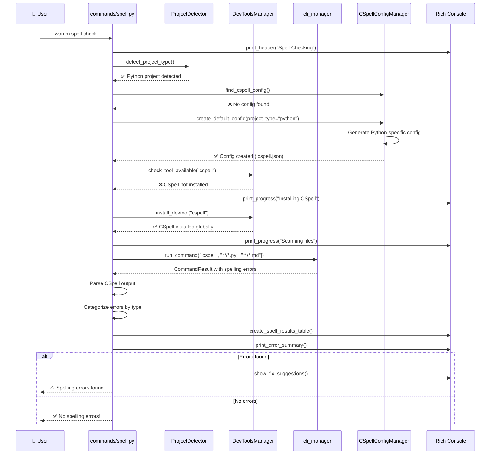
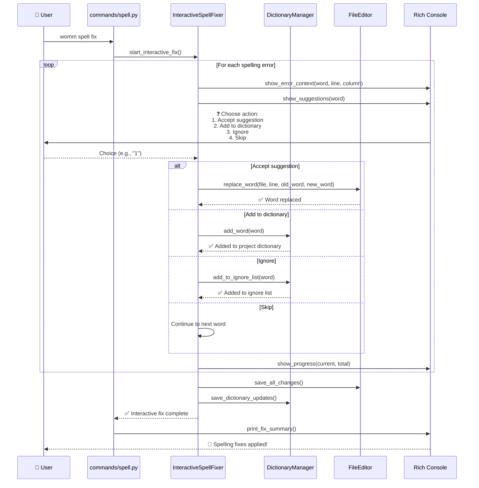

# Flow Spell - womm spell [operation]

## Processus de Vérification Orthographique

```mermaid
flowchart TD
    START([👤 womm spell check]) --> PARSE[📋 Parse Arguments<br/>check, fix, config]
    PARSE --> OPERATION{🎯 Which operation?}
    
    OPERATION -->|check| SPELLCHECK[📝 Spell Check Flow]
    OPERATION -->|fix| SPELLFIX[🔧 Spell Fix Flow]
    OPERATION -->|config| SPELLCONFIG[⚙️ Spell Config Flow]
    
    %% Spell Check Flow
    SPELLCHECK --> DETECTPROJECT[🔍 Detect Project Type<br/>ProjectDetector.detect_project_type()]
    DETECTPROJECT --> FINDCSPELL[🔍 Find CSpell Config<br/>.cspell.json, cspell.config.js]
    
    FINDCSPELL -->|Found| LOADCONFIG[📋 Load Existing Config]
    FINDCSPELL -->|Not found| CREATECONFIG[⚙️ Create Default Config]
    
    LOADCONFIG --> CHECKTOOL
    CREATECONFIG --> CHECKTOOL[🛠️ Check CSpell Tool<br/>DevToolsManager.check_tool()]
    
    CHECKTOOL -->|Available| SCANFILES
    CHECKTOOL -->|Missing| INSTALLCSPELL[📦 Install CSpell<br/>npm install -g cspell]
    
    INSTALLCSPELL --> VERIFYCSPELL[✅ Verify CSpell Installation]
    VERIFYCSPELL --> SCANFILES
    
    SCANFILES[📂 Scan Files for Spelling] --> INCLUDEPATTERNS[📋 Apply Include Patterns<br/>*.md, *.txt, *.py, *.js]
    INCLUDEPATTERNS --> EXCLUDEPATTERNS[🚫 Apply Exclude Patterns<br/>node_modules, .git, dist]
    
    EXCLUDEPATTERNS --> RUNCHECK[⚡ Run CSpell Check<br/>cspell "**/*"]
    RUNCHECK --> PARSERESULTS[📊 Parse Spell Results]
    
    PARSERESULTS --> CATEGORIZE[📂 Categorize Errors<br/>Unknown words, Suggestions]
    CATEGORIZE --> CHECKDICT{📚 Check dictionaries?}
    
    CHECKDICT -->|Project dict| PROJECTDICT[📖 Load Project Dictionary<br/>.cspell-dict.txt]
    CHECKDICT -->|Language dict| LANGDICT[🌐 Load Language Dictionaries<br/>Technical terms, framework words]
    CHECKDICT -->|No dict| REPORTERRORS
    
    PROJECTDICT --> FILTERKNOWN[🔍 Filter Known Words]
    LANGDICT --> FILTERKNOWN
    FILTERKNOWN --> REPORTERRORS[📋 Generate Error Report]
    
    %% Spell Fix Flow
    SPELLFIX --> DETECTFIXPROJECT[🔍 Detect Project for Fix]
    DETECTFIXPROJECT --> RUNFIXCHECK[📝 Run Check First]
    RUNFIXCHECK --> FIXRESULTS{❓ Errors found?}
    
    FIXRESULTS -->|No errors| NOFIX[ℹ️ No spelling errors to fix]
    FIXRESULTS -->|Errors found| INTERACTIVE[🤔 Interactive Fix Mode]
    
    INTERACTIVE --> SHOWERROR[📋 Show Error Context<br/>Line, column, suggestions]
    SHOWERROR --> FIXOPTIONS[❓ Fix Options<br/>1. Accept suggestion<br/>2. Add to dictionary<br/>3. Ignore<br/>4. Skip]
    
    FIXOPTIONS -->|Accept| APPLYFIX[✏️ Apply Suggestion<br/>Replace in file]
    FIXOPTIONS -->|Add dict| ADDDICT[📚 Add to Project Dictionary]
    FIXOPTIONS -->|Ignore| ADDIGNORE[🙈 Add to Ignore List]
    FIXOPTIONS -->|Skip| NEXTWORD[➡️ Next Word]
    
    APPLYFIX --> NEXTWORD
    ADDDICT --> NEXTWORD
    ADDIGNORE --> NEXTWORD
    NEXTWORD --> MOREWORDS{➡️ More words?}
    
    MOREWORDS -->|Yes| SHOWERROR
    MOREWORDS -->|No| SAVECHANGES[💾 Save All Changes]
    
    %% Spell Config Flow
    SPELLCONFIG --> CONFIGOP{⚙️ Config operation?}
    
    CONFIGOP -->|init| INITCONFIG[🆕 Initialize Config<br/>Create .cspell.json]
    CONFIGOP -->|update| UPDATECONFIG[🔄 Update Existing Config]
    CONFIGOP -->|dict| DICTCONFIG[📚 Dictionary Management]
    
    INITCONFIG --> SELECTLANG[🌐 Select Languages<br/>en-US, fr-FR, etc.]
    SELECTLANG --> SELECTFILES[📂 Select File Patterns<br/>Include/exclude patterns]
    SELECTFILES --> CONFIGDICTS[📚 Configure Dictionaries<br/>Built-in + custom]
    CONFIGDICTS --> WRITECONFIG[💾 Write Config File]
    
    UPDATECONFIG --> LOADEXISTING[📋 Load Existing Config]
    LOADEXISTING --> MERGECHANGES[🔄 Merge New Settings]
    MERGECHANGES --> WRITECONFIG
    
    DICTCONFIG --> DICTOP{📚 Dictionary operation?}
    DICTOP -->|add| ADDWORD[➕ Add Word to Dictionary]
    DICTOP -->|remove| REMOVEWORD[➖ Remove Word from Dictionary]
    DICTOP -->|list| LISTWORDS[📋 List Dictionary Words]
    
    ADDWORD --> UPDATEDICT[💾 Update Dictionary File]
    REMOVEWORD --> UPDATEDICT
    LISTWORDS --> SHOWWORDS[📋 Display Words]
    
    %% Results consolidation
    REPORTERRORS --> DISPLAY[🎉 Display Results<br/>Rich tables, statistics]
    NOFIX --> DISPLAY
    SAVECHANGES --> DISPLAY
    WRITECONFIG --> DISPLAY
    UPDATEDICT --> DISPLAY
    SHOWWORDS --> DISPLAY
    
    DISPLAY --> SUMMARY[📊 Generate Summary<br/>Errors found, fixes applied]
    SUMMARY --> RECOMMENDATIONS[💡 Recommendations<br/>Dictionary additions, ignore patterns]
    RECOMMENDATIONS --> NEXTSTEPS[📋 Next Steps<br/>CI integration, automation]
    NEXTSTEPS --> END[✨ Spell Check Complete]
    
    %% Styles
    classDef startEnd fill:#e1f5fe,stroke:#01579b,stroke-width:3px
    classDef process fill:#e8f5e8,stroke:#1b5e20,stroke-width:2px
    classDef decision fill:#fff3e0,stroke:#e65100,stroke-width:2px
    classDef success fill:#e8f5e8,stroke:#2e7d32,stroke-width:3px
    classDef info fill:#e3f2fd,stroke:#1976d2,stroke-width:2px
    classDef interactive fill:#f3e5f5,stroke:#4a148c,stroke-width:2px
    classDef config fill:#fff8e1,stroke:#f57c00,stroke-width:2px
    classDef dictionary fill:#f1f8e9,stroke:#33691e,stroke-width:2px
    
    class START,END startEnd
    class PARSE,DETECTPROJECT,FINDCSPELL,LOADCONFIG,CREATECONFIG,CHECKTOOL,INSTALLCSPELL,VERIFYCSPELL,SCANFILES,INCLUDEPATTERNS,EXCLUDEPATTERNS,RUNCHECK,PARSERESULTS,CATEGORIZE,PROJECTDICT,LANGDICT,FILTERKNOWN,REPORTERRORS,DETECTFIXPROJECT,RUNFIXCHECK,SHOWERROR,APPLYFIX,ADDDICT,ADDIGNORE,NEXTWORD,SAVECHANGES,INITCONFIG,UPDATECONFIG,SELECTLANG,SELECTFILES,CONFIGDICTS,WRITECONFIG,LOADEXISTING,MERGECHANGES,ADDWORD,REMOVEWORD,LISTWORDS,UPDATEDICT,SHOWWORDS,DISPLAY,SUMMARY,RECOMMENDATIONS,NEXTSTEPS process
    class OPERATION,CHECKDICT,FIXRESULTS,MOREWORDS,CONFIGOP,DICTOP decision
    class NOFIX info
    class INTERACTIVE,FIXOPTIONS interactive
    class SPELLCONFIG,DICTCONFIG config
    class PROJECTDICT,LANGDICT,ADDDICT,DICTCONFIG,UPDATEDICT dictionary
```

## Séquence de Vérification Orthographique



## Séquence de Fix Interactif


