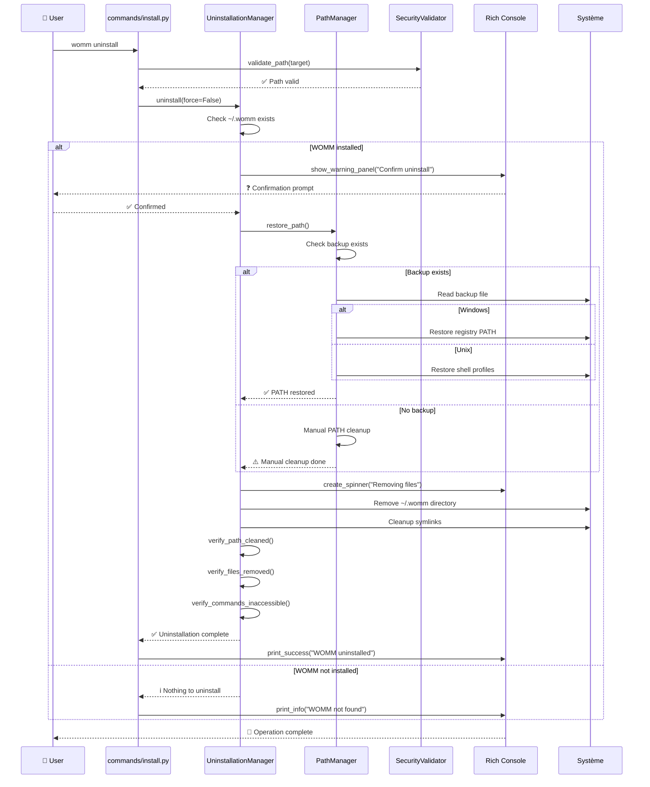

# Flow Uninstall - womm uninstall

## Processus de Désinstallation

```mermaid
flowchart TD
    START([👤 womm uninstall]) --> PARSE[📋 Parse Arguments<br/>--force, --target]
    PARSE --> VALIDATE[🔒 Security Validation<br/>Validate target path]
    
    VALIDATE -->|✅ Valid| UNINSTMGR[🗑️ UninstallationManager<br/>Initialize with target]
    VALIDATE -->|❌ Invalid| ERROR1[❌ Exit with error]
    
    UNINSTMGR --> CHECKWOMM[📁 Check WOMM Directory<br/>~/.womm exists?]
    
    CHECKWOMM -->|Exists| CHECKFORCE{🤔 Force flag?}
    CHECKWOMM -->|Not exists| NOTWOMM[ℹ️ WOMM not installed]
    
    CHECKFORCE -->|--force| PATHRESTORE
    CHECKFORCE -->|No force| CONFIRM[❓ Confirmation Prompt<br/>Really uninstall?]
    
    CONFIRM -->|Yes| PATHRESTORE[🛤️ Restore PATH<br/>PathManager.restore_path()]
    CONFIRM -->|No| CANCEL[🚫 Uninstallation cancelled]
    
    PATHRESTORE --> CHECKBACKUP{💾 Backup exists?}
    
    CHECKBACKUP -->|Yes| RESTOREPATH[🔄 Restore from backup]
    CHECKBACKUP -->|No| MANUALPATH[⚠️ Manual PATH cleanup]
    
    RESTOREPATH -->|Windows| WINRESTORE[🪟 Restore Registry<br/>HKCU\Environment]
    RESTOREPATH -->|Unix| UNIXRESTORE[🐧 Restore Shell Profiles<br/>.bashrc/.zshrc]
    
    MANUALPATH --> REMOVEPATH[🧹 Remove WOMM from PATH<br/>String replacement]
    
    WINRESTORE --> VERIFYRESTORE
    UNIXRESTORE --> VERIFYRESTORE
    REMOVEPATH --> VERIFYRESTORE
    
    VERIFYRESTORE[✅ Verify PATH Restoration] --> REMOVEFILES[🗂️ Remove WOMM Directory<br/>Recursive deletion]
    
    REMOVEFILES --> CLEANUP[🧽 Cleanup Operations<br/>Remove symlinks, cache]
    
    CLEANUP --> VERIFY[🔍 Verification]
    
    VERIFY --> VERIFYPATH[🛤️ Verify PATH Cleaned]
    VERIFYPATH --> VERIFYFILES[📁 Verify Files Removed]
    VERIFYFILES --> VERIFYCMD[⚡ Verify Commands Inaccessible]
    
    VERIFYCMD -->|✅ All Pass| SUCCESS[🎉 Uninstallation Success<br/>WOMM completely removed]
    VERIFYCMD -->|❌ Any Fail| WARNING[⚠️ Partial Uninstallation<br/>Manual cleanup needed]
    
    NOTWOMM --> INFO[ℹ️ Nothing to uninstall]
    
    %% Error endings
    ERROR1 --> END1[🛑 End]
    CANCEL --> END2[🛑 End]
    INFO --> END3[ℹ️ End]
    WARNING --> END4[⚠️ End]
    SUCCESS --> END5[✨ End]
    
    %% Styles
    classDef startEnd fill:#e1f5fe,stroke:#01579b,stroke-width:3px
    classDef process fill:#e8f5e8,stroke:#1b5e20,stroke-width:2px
    classDef decision fill:#fff3e0,stroke:#e65100,stroke-width:2px
    classDef error fill:#ffebee,stroke:#c62828,stroke-width:2px
    classDef success fill:#e8f5e8,stroke:#2e7d32,stroke-width:3px
    classDef warning fill:#fff8e1,stroke:#f57c00,stroke-width:2px
    classDef info fill:#e3f2fd,stroke:#1976d2,stroke-width:2px
    classDef security fill:#f3e5f5,stroke:#4a148c,stroke-width:2px
    
    class START,END1,END2,END3,END4,END5 startEnd
    class PARSE,UNINSTMGR,PATHRESTORE,RESTOREPATH,WINRESTORE,UNIXRESTORE,MANUALPATH,REMOVEPATH,REMOVEFILES,CLEANUP,VERIFY,VERIFYPATH,VERIFYFILES,VERIFYCMD process
    class CHECKWOMM,CHECKFORCE,CONFIRM,CHECKBACKUP decision
    class ERROR1,CANCEL error
    class SUCCESS,VERIFYRESTORE success
    class WARNING warning
    class NOTWOMM,INFO info
    class VALIDATE security
```

## Séquence de Désinstallation


