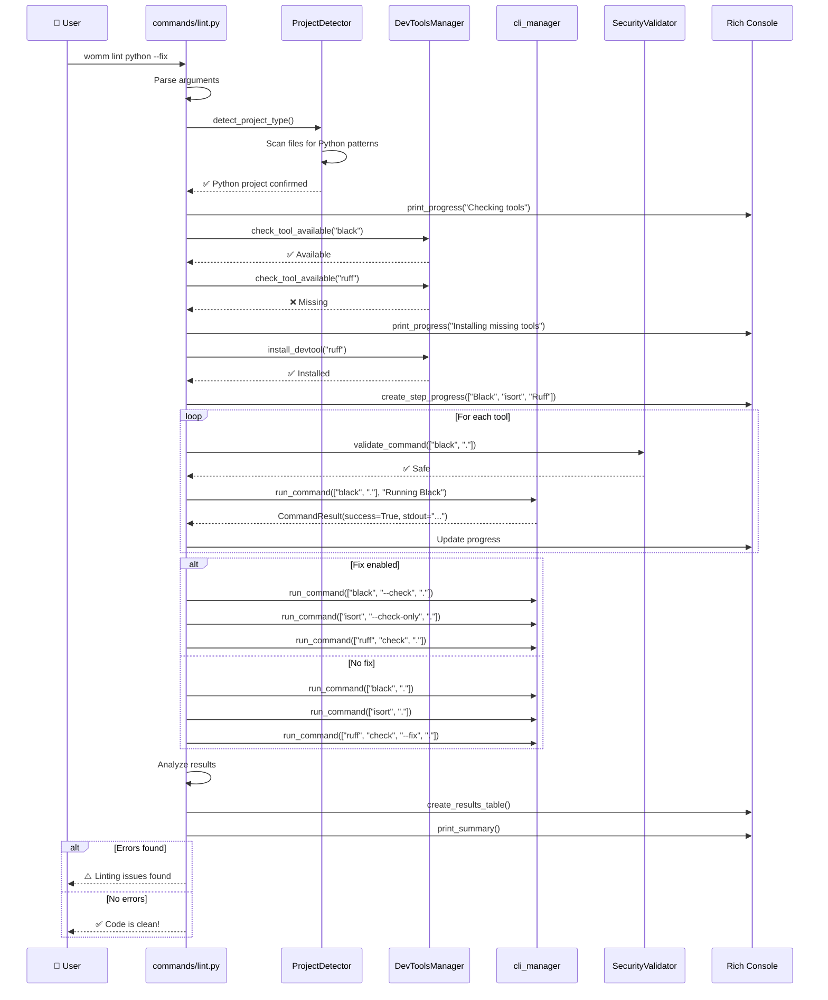

# Flow Lint - womm lint [language]

## Processus de Linting et Qualité Code

```mermaid
flowchart TD
    START([👤 womm lint python --fix]) --> PARSE[📋 Parse Arguments<br/>language, --fix, --all]
    PARSE --> DETECT{🔍 Language specified?}

    DETECT -->|Specific| VALIDATE[🔒 Validate Language<br/>python, javascript, all]
    DETECT -->|None| AUTODETECT[🎯 Auto-detect Project<br/>ProjectDetector.detect_project_type()]

    AUTODETECT --> SCAN[🔍 Scan Current Directory<br/>File patterns, extensions]
    SCAN --> SCORE[🎯 Calculate Confidence Scores<br/>pyproject.toml, package.json, etc.]
    SCORE --> DETERMINED[📋 Language Determined]

    VALIDATE --> DETERMINED
    DETERMINED --> SWITCH{🎭 Which language?}

    SWITCH -->|Python| PYLINT[🐍 Python Linting Flow]
    SWITCH -->|JavaScript| JSLINT[🟨 JavaScript Linting Flow]
    SWITCH -->|All| ALLLINT[🌟 All Languages Flow]

    %% Python Linting Flow
    PYLINT --> PYCHECK[🔍 Check Python Tools<br/>black, isort, ruff, flake8]
    PYCHECK --> PYTOOLS{🛠️ Tools available?}

    PYTOOLS -->|Missing| PYINSTALL[📦 Install Missing Tools<br/>DevToolsManager.install()]
    PYTOOLS -->|Available| PYRUN
    PYINSTALL --> PYRUN

    PYRUN[⚡ Run Python Linting] --> PYBLACK[🖤 Run Black<br/>Code formatting]
    PYBLACK --> PYISORT[📦 Run isort<br/>Import sorting]
    PYISORT --> PYRUFF[🚀 Run Ruff<br/>Fast linting]

    PYRUFF --> PYFIX{🔧 Fix flag enabled?}
    PYFIX -->|Yes| PYAUTOFIX[🔧 Apply Auto-fixes<br/>--fix parameter]
    PYFIX -->|No| PYRESULTS
    PYAUTOFIX --> PYRESULTS[📊 Collect Results]

    PYRESULTS --> PYREPORT[📋 Generate Report<br/>Rich tables, colors]
    PYREPORT --> PYSUCCESS[✅ Python Linting Complete]

    %% JavaScript Linting Flow
    JSLINT --> JSCHECK[🔍 Check JS Tools<br/>eslint, prettier, tsc]
    JSCHECK --> JSTOOLS{🛠️ Tools available?}

    JSTOOLS -->|Missing| JSINSTALL[📦 Install Missing Tools<br/>npm install -g]
    JSTOOLS -->|Available| JSRUN
    JSINSTALL --> JSRUN

    JSRUN[⚡ Run JavaScript Linting] --> JSESLINT[🔧 Run ESLint<br/>Code quality rules]
    JSESLINT --> JSPRETTIER[💅 Run Prettier<br/>Code formatting]
    JSPRETTIER --> JSTSC{📘 TypeScript project?}

    JSTSC -->|Yes| JTYPESCRIPT[📘 Run TypeScript Check<br/>tsc --noEmit]
    JSTSC -->|No| JSFIX
    JTYPESCRIPT --> JSFIX

    JSFIX{🔧 Fix flag enabled?} -->|Yes| JSAUTOFIX[🔧 Apply Auto-fixes<br/>eslint --fix, prettier --write]
    JSFIX -->|No| JSRESULTS
    JSAUTOFIX --> JSRESULTS[📊 Collect Results]

    JSRESULTS --> JSREPORT[📋 Generate Report<br/>Rich tables, colors]
    JSREPORT --> JSSUCCESS[✅ JavaScript Linting Complete]

    %% All Languages Flow
    ALLLINT --> ALLDETECT[🔍 Detect All Languages<br/>Scan workspace for projects]
    ALLDETECT --> PYTHONFOUND{🐍 Python found?}

    PYTHONFOUND -->|Yes| RUNPYLINT[🐍 Run Python Linting]
    PYTHONFOUND -->|No| JSFOUND
    RUNPYLINT --> JSFOUND

    JSFOUND{🟨 JavaScript found?} -->|Yes| RUNJSLINT[🟨 Run JavaScript Linting]
    JSFOUND -->|No| OTHERFOUND
    RUNJSLINT --> OTHERFOUND

    OTHERFOUND{🔮 Other languages?} -->|Yes| RUNOTHER[🔮 Run Other Linting]
    OTHERFOUND -->|No| ALLRESULTS
    RUNOTHER --> ALLRESULTS

    ALLRESULTS[📊 Consolidate All Results] --> ALLREPORT[📋 Generate Combined Report]
    ALLREPORT --> ALLSUCCESS[✅ All Linting Complete]

    %% Success consolidation
    PYSUCCESS --> DISPLAY[🎉 Display Results<br/>Summary, statistics, next steps]
    JSSUCCESS --> DISPLAY
    ALLSUCCESS --> DISPLAY

    DISPLAY --> EXITCODE{❓ Any errors found?}
    EXITCODE -->|Yes| WARNING[⚠️ Exit with warning code]
    EXITCODE -->|No| SUCCESS[✅ Exit success]

    WARNING --> END1[🛑 End with warnings]
    SUCCESS --> END2[✨ End clean]

    %% Styles
    classDef startEnd fill:#e1f5fe,stroke:#01579b,stroke-width:3px
    classDef process fill:#e8f5e8,stroke:#1b5e20,stroke-width:2px
    classDef decision fill:#fff3e0,stroke:#e65100,stroke-width:2px
    classDef success fill:#e8f5e8,stroke:#2e7d32,stroke-width:3px
    classDef warning fill:#fff8e1,stroke:#f57c00,stroke-width:2px
    classDef security fill:#f3e5f5,stroke:#4a148c,stroke-width:2px
    classDef python fill:#e8f4fd,stroke:#1565c0,stroke-width:2px
    classDef javascript fill:#fff8e1,stroke:#f57c00,stroke-width:2px
    classDef tools fill:#f1f8e9,stroke:#33691e,stroke-width:2px

    class START,END1,END2 startEnd
    class PARSE,AUTODETECT,SCAN,SCORE,DETERMINED,PYCHECK,PYRUN,PYBLACK,PYISORT,PYRUFF,PYAUTOFIX,PYRESULTS,PYREPORT,JSCHECK,JSRUN,JSESLINT,JSPRETTIER,JTYPESCRIPT,JSAUTOFIX,JSRESULTS,JSREPORT,ALLDETECT,RUNPYLINT,RUNJSLINT,RUNOTHER,ALLRESULTS,ALLREPORT,DISPLAY process
    class DETECT,SWITCH,PYTOOLS,PYFIX,JSTOOLS,JSTSC,JSFIX,PYTHONFOUND,JSFOUND,OTHERFOUND,EXITCODE decision
    class PYSUCCESS,JSSUCCESS,ALLSUCCESS,SUCCESS success
    class WARNING warning
    class VALIDATE security
    class PYLINT python
    class JSLINT javascript
    class PYINSTALL,JSINSTALL tools
```

## Séquence de Linting Python Détaillée


