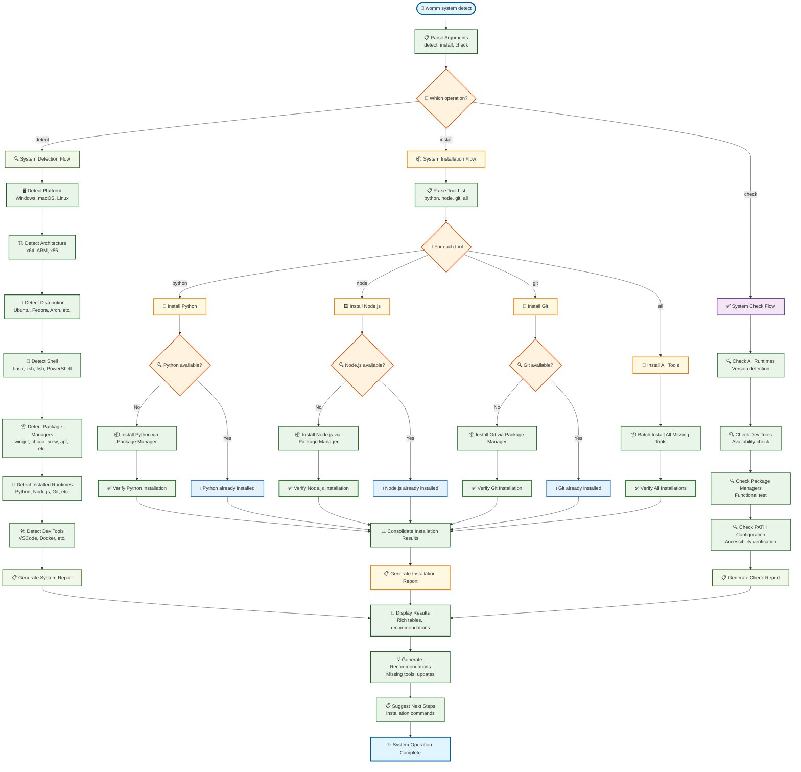
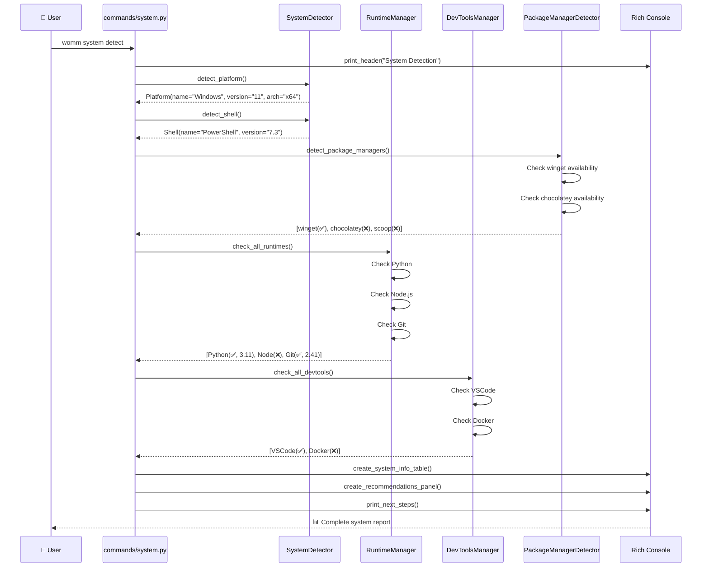
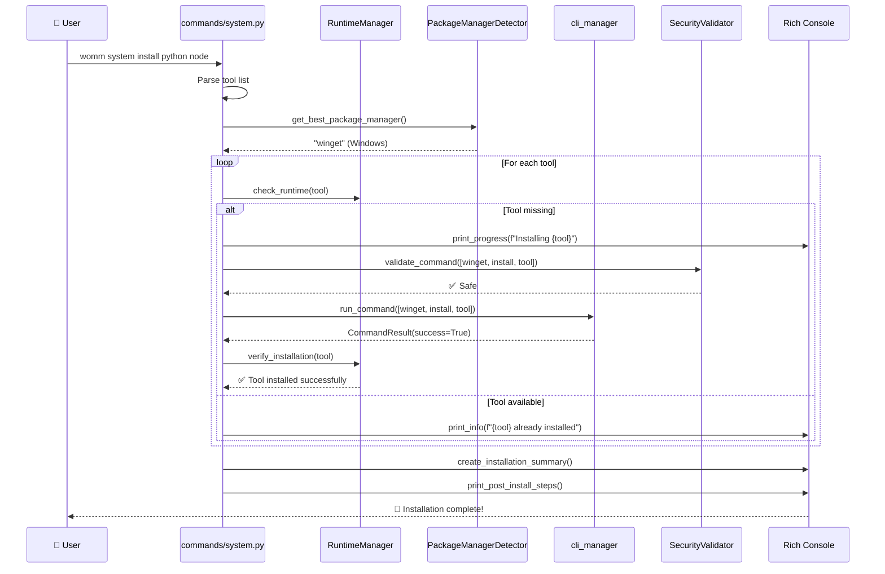

# Flow System - womm system [operation]

## Processus de Détection et Installation Système

```mermaid
flowchart TD
    START([👤 womm system detect]) --> PARSE[📋 Parse Arguments<br/>detect, install, check]
    PARSE --> OPERATION{🎯 Which operation?}

    OPERATION -->|detect| SYSDETECT[🔍 System Detection Flow]
    OPERATION -->|install| SYSINSTALL[📦 System Installation Flow]
    OPERATION -->|check| SYSCHECK[✅ System Check Flow]

    %% System Detection Flow
    SYSDETECT --> PLATFORM[🖥️ Detect Platform<br/>Windows, macOS, Linux]
    PLATFORM --> ARCH[🏗️ Detect Architecture<br/>x64, ARM, x86]
    ARCH --> DISTRO[🐧 Detect Distribution<br/>Ubuntu, Fedora, Arch, etc.]
    DISTRO --> SHELL[🐚 Detect Shell<br/>bash, zsh, fish, PowerShell]
    SHELL --> PKGMGR[📦 Detect Package Managers<br/>winget, choco, brew, apt, etc.]
    PKGMGR --> RUNTIMES[🚀 Detect Installed Runtimes<br/>Python, Node.js, Git, etc.]
    RUNTIMES --> DEVTOOLS[🛠️ Detect Dev Tools<br/>VSCode, Docker, etc.]
    DEVTOOLS --> SYSREPORT[📋 Generate System Report]

    %% System Installation Flow
    SYSINSTALL --> PARSETOOLS[📋 Parse Tool List<br/>python, node, git, all]
    PARSETOOLS --> TOOLSLOOP{🔄 For each tool}

    TOOLSLOOP -->|python| INSTALLPY[🐍 Install Python]
    TOOLSLOOP -->|node| INSTALLNODE[🟨 Install Node.js]
    TOOLSLOOP -->|git| INSTALLGIT[🌿 Install Git]
    TOOLSLOOP -->|all| INSTALLALL[🌟 Install All Tools]

    INSTALLPY --> PYCHECK{🔍 Python available?}
    PYCHECK -->|No| PYINSTALL[📦 Install Python via Package Manager]
    PYCHECK -->|Yes| PYSKIP[ℹ️ Python already installed]

    INSTALLNODE --> NODECHECK{🔍 Node.js available?}
    NODECHECK -->|No| NODEINSTALL[📦 Install Node.js via Package Manager]
    NODECHECK -->|Yes| NODESKIP[ℹ️ Node.js already installed]

    INSTALLGIT --> GITCHECK{🔍 Git available?}
    GITCHECK -->|No| GITINSTALL[📦 Install Git via Package Manager]
    GITCHECK -->|Yes| GITSKIP[ℹ️ Git already installed]

    INSTALLALL --> BATCHINSTALL[📦 Batch Install All Missing Tools]

    PYINSTALL --> PYVERIFY[✅ Verify Python Installation]
    NODEINSTALL --> NODEVERIFY[✅ Verify Node.js Installation]
    GITINSTALL --> GITVERIFY[✅ Verify Git Installation]
    BATCHINSTALL --> BATCHVERIFY[✅ Verify All Installations]

    PYSKIP --> INSTALLRESULTS
    NODESKIP --> INSTALLRESULTS
    GITSKIP --> INSTALLRESULTS
    PYVERIFY --> INSTALLRESULTS
    NODEVERIFY --> INSTALLRESULTS
    GITVERIFY --> INSTALLRESULTS
    BATCHVERIFY --> INSTALLRESULTS

    INSTALLRESULTS[📊 Consolidate Installation Results] --> INSTALLREPORT[📋 Generate Installation Report]

    %% System Check Flow
    SYSCHECK --> CHECKRUNTIMES[🔍 Check All Runtimes<br/>Version detection]
    CHECKRUNTIMES --> CHECKDEVTOOLS[🔍 Check Dev Tools<br/>Availability check]
    CHECKDEVTOOLS --> CHECKPKGMGR[🔍 Check Package Managers<br/>Functional test]
    CHECKPKGMGR --> CHECKPATHS[🔍 Check PATH Configuration<br/>Accessibility verification]
    CHECKPATHS --> CHECKREPORT[📋 Generate Check Report]

    %% Report consolidation
    SYSREPORT --> DISPLAY[🎉 Display Results<br/>Rich tables, recommendations]
    INSTALLREPORT --> DISPLAY
    CHECKREPORT --> DISPLAY

    DISPLAY --> RECOMMENDATIONS[💡 Generate Recommendations<br/>Missing tools, updates]
    RECOMMENDATIONS --> NEXTSTEPS[📋 Suggest Next Steps<br/>Installation commands]
    NEXTSTEPS --> END[✨ System Operation Complete]

    %% Styles
    classDef startEnd fill:#e1f5fe,stroke:#01579b,stroke-width:3px
    classDef process fill:#e8f5e8,stroke:#1b5e20,stroke-width:2px
    classDef decision fill:#fff3e0,stroke:#e65100,stroke-width:2px
    classDef success fill:#e8f5e8,stroke:#2e7d32,stroke-width:3px
    classDef info fill:#e3f2fd,stroke:#1976d2,stroke-width:2px
    classDef detection fill:#f1f8e9,stroke:#33691e,stroke-width:2px
    classDef installation fill:#fff8e1,stroke:#f57c00,stroke-width:2px
    classDef verification fill:#f3e5f5,stroke:#4a148c,stroke-width:2px

    class START,END startEnd
    class PARSE,PLATFORM,ARCH,DISTRO,SHELL,PKGMGR,RUNTIMES,DEVTOOLS,PARSETOOLS,PYINSTALL,NODEINSTALL,GITINSTALL,BATCHINSTALL,CHECKRUNTIMES,CHECKDEVTOOLS,CHECKPKGMGR,CHECKPATHS,INSTALLRESULTS,DISPLAY,RECOMMENDATIONS,NEXTSTEPS process
    class OPERATION,TOOLSLOOP,PYCHECK,NODECHECK,GITCHECK decision
    class PYVERIFY,NODEVERIFY,GITVERIFY,BATCHVERIFY success
    class PYSKIP,NODESKIP,GITSKIP info
    class SYSDETECT,SYSREPORT,CHECKREPORT detection
    class SYSINSTALL,INSTALLPY,INSTALLNODE,INSTALLGIT,INSTALLALL,INSTALLREPORT installation
    class SYSCHECK verification
```

## Séquence de Détection Système

```mermaid
sequenceDiagram
    participant User as 👤 User
    participant CLI as commands/system.py
    participant SysDetector as SystemDetector
    participant RuntimeMgr as RuntimeManager
    participant DevToolsMgr as DevToolsManager
    participant PkgMgr as PackageManagerDetector
    participant UI as Rich Console

    User->>CLI: womm system detect
    CLI->>UI: print_header("System Detection")

    CLI->>SysDetector: detect_platform()
    SysDetector-->>CLI: Platform(name="Windows", version="11", arch="x64")

    CLI->>SysDetector: detect_shell()
    SysDetector-->>CLI: Shell(name="PowerShell", version="7.3")

    CLI->>PkgMgr: detect_package_managers()
    PkgMgr->>PkgMgr: Check winget availability
    PkgMgr->>PkgMgr: Check chocolatey availability
    PkgMgr-->>CLI: [winget(✅), chocolatey(❌), scoop(❌)]

    CLI->>RuntimeMgr: check_all_runtimes()
    RuntimeMgr->>RuntimeMgr: Check Python
    RuntimeMgr->>RuntimeMgr: Check Node.js
    RuntimeMgr->>RuntimeMgr: Check Git
    RuntimeMgr-->>CLI: [Python(✅, 3.11), Node(❌), Git(✅, 2.41)]

    CLI->>DevToolsMgr: check_all_devtools()
    DevToolsMgr->>DevToolsMgr: Check VSCode
    DevToolsMgr->>DevToolsMgr: Check Docker
    DevToolsMgr-->>CLI: [VSCode(✅), Docker(❌)]

    CLI->>UI: create_system_info_table()
    CLI->>UI: create_recommendations_panel()
    CLI->>UI: print_next_steps()

    UI-->>User: 📊 Complete system report
```

## Séquence d'Installation d'Outils

```mermaid
sequenceDiagram
    participant User as 👤 User
    participant CLI as commands/system.py
    participant RuntimeMgr as RuntimeManager
    participant PkgMgr as PackageManagerDetector
    participant CLIMgr as cli_manager
    participant Security as SecurityValidator
    participant UI as Rich Console

    User->>CLI: womm system install python node
    CLI->>CLI: Parse tool list

    CLI->>PkgMgr: get_best_package_manager()
    PkgMgr-->>CLI: "winget" (Windows)

    loop For each tool
        CLI->>RuntimeMgr: check_runtime(tool)

        alt Tool missing
            CLI->>UI: print_progress(f"Installing {tool}")
            CLI->>Security: validate_command([winget, install, tool])
            Security-->>CLI: ✅ Safe

            CLI->>CLIMgr: run_command([winget, install, tool])
            CLIMgr-->>CLI: CommandResult(success=True)

            CLI->>RuntimeMgr: verify_installation(tool)
            RuntimeMgr-->>CLI: ✅ Tool installed successfully

        else Tool available
            CLI->>UI: print_info(f"{tool} already installed")
        end
    end

    CLI->>UI: create_installation_summary()
    CLI->>UI: print_post_install_steps()

    UI-->>User: 🎉 Installation complete!
```
